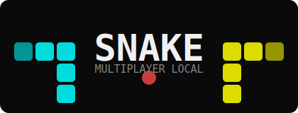

<p align="center">
  
</p>

<p align="center">
  Jogo da cobrinha <strong>multiplayer local</strong> para <strong>até 4 jogadores simultâneos</strong>,<br>
  construído sobre a arquitetura do Asteroids Singleplayer.<br>
  <em>Atividade 0010 | UEA · Tópicos Especiais I</em>
</p>

---

<h2 align="center">Tecnologias Utilizadas</h2>

<p align="center">
  
  
  
  
</p>

---

<h2 align="center">Descrição do Projeto</h2>

Este projeto é o clássico jogo da cobrinha reimplementado como **multiplayer local** para até quatro jogadores no mesmo teclado. A base arquitetural foi herdada do repositório [asteroids_single-player](../asteroids_single-player), mantendo a separação entre domínio (`core/`) e apresentação (`client/`).

Cada jogador controla uma cobra independente. A cobra cresce ao comer alimentos, e o jogo termina quando uma cobra colide com a parede, com o próprio corpo ou com o corpo da cobra adversária.

---

<h2 align="center">Mecânica do Jogo</h2>

**Objetivo**

Comer o maior número de alimentos possível sem colidir com paredes, com o próprio corpo ou com a cobra adversária.

**Regras**

- O tabuleiro tem 40 x 30 células de 20 px cada.
- A cobra se move uma célula por tick (a cada 0,12 s).
- Ao comer um alimento, a cobra cresce 3 células e um novo alimento aparece.
- Colisão com parede, corpo próprio ou corpo do adversário elimina a cobra.
- Colisão de cabeça contra cabeça no mesmo tick elimina ambas as cobras.
- A partida termina quando pelo menos uma cobra é eliminada.
- Vence quem sobreviver. Em caso de morte simultânea, vence quem tiver maior pontuação.

---

<h2 align="center">Controles</h2>

| Jogador | Cima | Baixo | Esquerda | Direita |
|---------|------|-------|----------|---------|
| **J1 (Ciano)** | `W` | `S` | `A` | `D` |
| **J2 (Amarelo)** | `↑` | `↓` | `←` | `→` |
| **J3 (Verde)** | `I` | `K` | `J` | `L` |
| **J4 (Vermelho)** | `Num8` | `Num2` | `Num4` | `Num6` |

`ESC` encerra o jogo a qualquer momento.

---

<h2 align="center">Estrutura do Projeto</h2>

```text
snake-multiplayer-local/
├── src/
│   ├── main.py              # ponto de entrada
│   ├── core/
│   │   ├── config.py        # constantes, cores e posições iniciais
│   │   ├── commands.py      # PlayerCommand (direção por frame)
│   │   ├── entities.py      # Snake (corpo, direção, crescimento) e Food
│   │   ├── world.py         # estado do jogo, tick, colisões e pontuação
│   │   ├── scene.py         # enum SceneState
│   │   └── utils.py         # células livres e posição aleatória
│   └── client/
│       ├── game.py          # loop principal e transições de cena
│       ├── renderer.py      # renderização de entidades e HUD
│       └── controls.py      # mapeamento de teclas para PlayerCommand
├── docs/
│   └── diagrams/
│       ├── logo.svg
│       ├── c4_nivel1_contexto.puml
│       ├── c4_nivel2_container.puml
│       └── c4_nivel3_componente.puml
├── requirements.txt
├── LICENSE
└── README.md
```

---

<h2 align="center">Como Executar</h2>

**1. Clonar o repositório**

```bash
git clone https://github.com/JulianaBallin/snake-multiplayer-local.git
cd snake-multiplayer-local
```

**2. Criar ambiente virtual**

```bash
python -m venv .venv
source .venv/bin/activate        # Linux/Mac
# .venv\Scripts\activate         # Windows
```

**3. Instalar dependências**

```bash
pip install -r requirements.txt
```

**4. Iniciar o jogo**

```bash
python src/main.py
```

---

<h2 align="center">Dependências</h2>

```txt
pygame>=2.5.0
```

---

<h2 align="center">Decisões Arquiteturais</h2>

A arquitetura segue o mesmo padrão do projeto Asteroids Singleplayer:

| Camada | Pacote | Responsabilidade |
|--------|--------|------------------|
| Domínio | `core/` | Toda a lógica do jogo: entidades, mundo, colisões e regras. Sem dependência de pygame. |
| Apresentação | `client/` | Loop do jogo, renderização e mapeamento de input. Depende de pygame e de `core/`. |
| Entrada | `main.py` | Ponto de entrada mínimo que instancia `Game` e chama `run()`. |

O isolamento do domínio permite testar a lógica do jogo sem inicializar display ou áudio.

---

<h2 align="center">Diagramas C4</h2>

Os diagramas estão em `docs/diagrams/` no formato PlantUML (`.puml`).

Para renderizar, use o [PlantUML Online Server](https://www.plantuml.com/plantuml/uml/) ou o plugin PlantUML no VS Code.

| Arquivo | Nível | Descrição |
|---------|-------|-----------|
| `c4_nivel1_contexto.puml` | Nível 1 | Visão geral: jogadores, sistema e pygame |
| `c4_nivel2_container.puml` | Nível 2 | Contêineres: main, core e client |
| `c4_nivel3_componente.puml` | Nível 3 | Componentes internos de core e client |

---

<h2 align="center">Limitações</h2>

- Até 4 jogadores simultâneos no mesmo teclado.
- Sem suporte a joystick ou controle externo.
- Sem salvamento de pontuação entre partidas.

---

<h2 align="center">Referências</h2>

- Playlist de referência: [youtube.com/playlist?list=PLlEgNdBJEO-n8k9SR49AshB9j7b5Iw7hZ](https://www.youtube.com/playlist?list=PLlEgNdBJEO-n8k9SR49AshB9j7b5Iw7hZ)
- Documentação do pygame: [pygame.org/docs](https://www.pygame.org/docs/)
- C4 Model: [c4model.com](https://c4model.com)

---

<h2 align="center">Equipe</h2>

<p align="center">

| Nome |
| ---- |
| Ana Beatriz Maciel Nunes |
| Fernando Luiz Da Silva Freire |
| Juliana Ballin Lima |

</p>

---

<h3 align="center">UEA · Tópicos Especiais I · Atividade 0010: Snake Multiplayer Local</h3>
